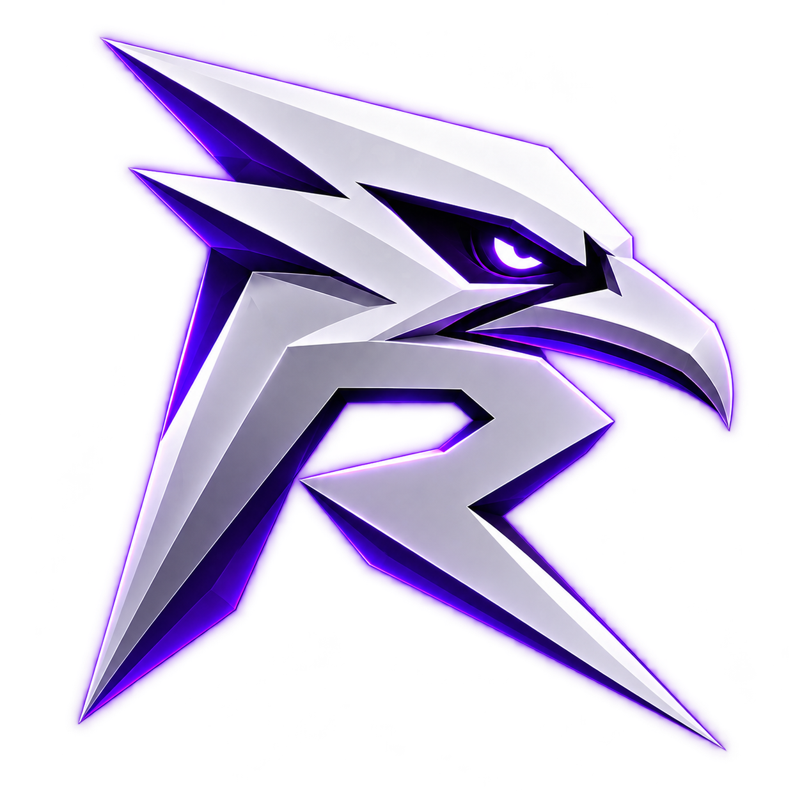
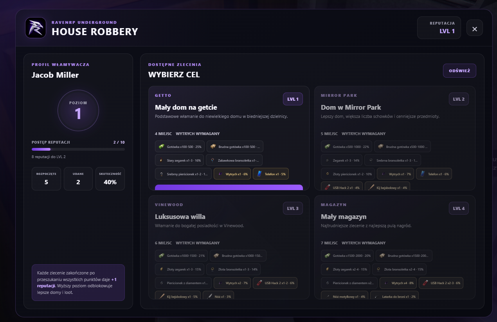

# RavenRP

**A FiveM roleplay server in development by Hanzolek.**

A project built around everyday roleplay, connected systems and a consistent player experience. The guiding idea is “from players, for players”, without a pay-to-win model.

> Portfolio showcase only. This repository contains descriptions and presentation images. Server files, scripts, third-party resources and credentials are not distributed here.

## Areas of development

| Area | Examples |
| --- | --- |
| Player experience | HUD, documents, interactions, appearance and character state |
| Economy | Shops, payments, vehicle dealerships and server balance |
| Jobs and services | Civilian jobs, mechanics, public services and invoices |
| Vehicles | Garages, keys, tuning, fuel and driving systems |
| Housing | Apartments, storage and separated interiors |
| Crime and progression | House robberies, heists, reputation and progression |
| Side activities | Fishing and hunting |

## Interface preview

## My role

Gameplay direction, configuration, custom changes, integration, interface refinement and testing. RavenRP combines solutions developed for the project with third-party resources; this showcase does not claim authorship of every component used by the server.

Technologies involved in the project include **FiveM, Lua and NUI interfaces**.

## Po polsku

RavenRP to rozwijany serwer FiveM. Pracuję nad jego mechanikami, konfiguracją, integracją systemów i spójną oprawą. Zakres obejmuje m.in. ekonomię, pojazdy, pracę służb, mieszkania, napady i aktywności poboczne.

Prezentuję tutaj projekt i zakres prac. Paczka serwera i skrypty nie są udostępniane.

**Author:** [Hanzolek / Hanzikkk](https://github.com/Hanzikkk)
